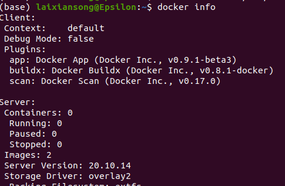

# omit endless "sudo" in docker
how avoid run "sudo docker ..." frequently.
1. add user in docker
see: 
[useradd](https://github.com/LaiXiansong/learn_ubuntu-linux/tree/main/user_group)
2. set docker.sock authority
```
sudo chmod a+rw /var/run/docker.sock
```
3. test
```
docker info
```

